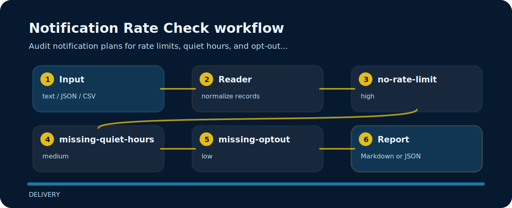

# Notification Rate Check

Audit notification plans for rate limits, quiet hours, and opt-out controls.


## Review path



## Review intent

- Targets notification quality instead of broad linting.
- Accepts plain text and returns terminal findings, optional json.
- Keeps each rule visible so the project can be tuned without hunting through prose.

## Rule ledger

- `no-rate-limit` - rate limit missing (high); define max notifications.
- `missing-quiet-hours` - quiet hours missing (medium); respect local quiet hours.
- `missing-optout` - opt-out missing (low); provide opt-out control.

## Try the fixture

```bash
git clone https://github.com/mertefekurt/notification-rate-check.git
cd notification-rate-check
python -m pip install -e ".[dev]"
notification-rate-check examples/sample.txt
```
