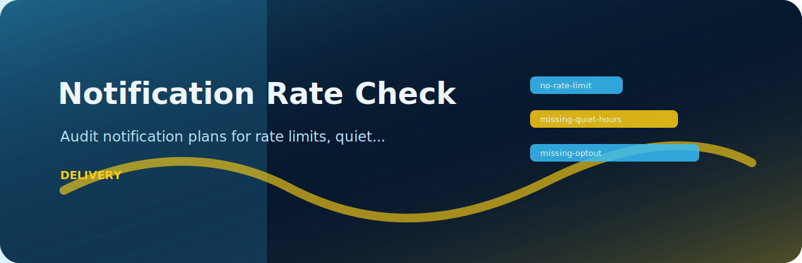

# Notification Rate Check



> Audit notification plans for rate limits, quiet hours, and opt-out controls

   

## At a glance

| Area | Detail |
| --- | --- |
| Focus | notification quality |
| Command | `notification-rate-check` |
| Formats | text, JSON, JSONL, CSV |
| Output | Markdown table or JSON |

## What it checks

| Rule | Severity | What it catches |
| --- | --- | --- |
| `no-rate-limit` | high | rate limit missing |
| `missing-quiet-hours` | medium | quiet hours missing |
| `missing-optout` | low | opt-out missing |

## Try it locally

```bash
python -m pip install -e ".[dev]"
notification-rate-check examples/sample.txt
notification-rate-check examples/sample.txt --json --fail-on medium
```

## Notes from the code

`rules.py` keeps the project policy explicit, while `core.py` handles parsing and report rendering. The CLI stays thin on purpose so the checks are easy to test.

## Verify

```bash
python -m pip install -e ".[dev]"
ruff check .
pytest
python -m notification_rate_check --help
```
